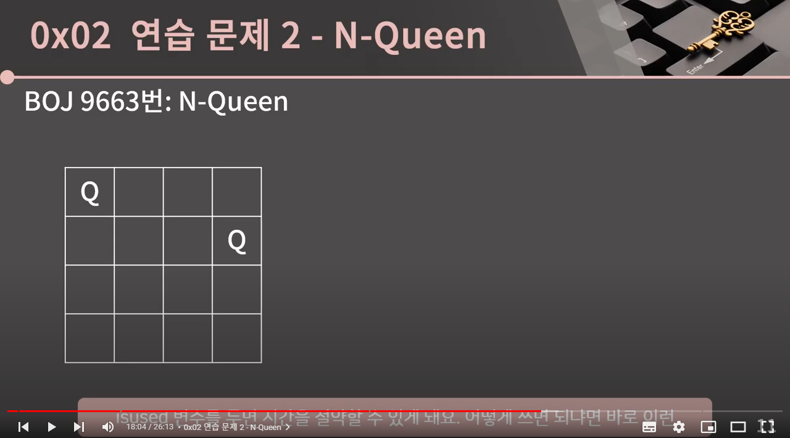
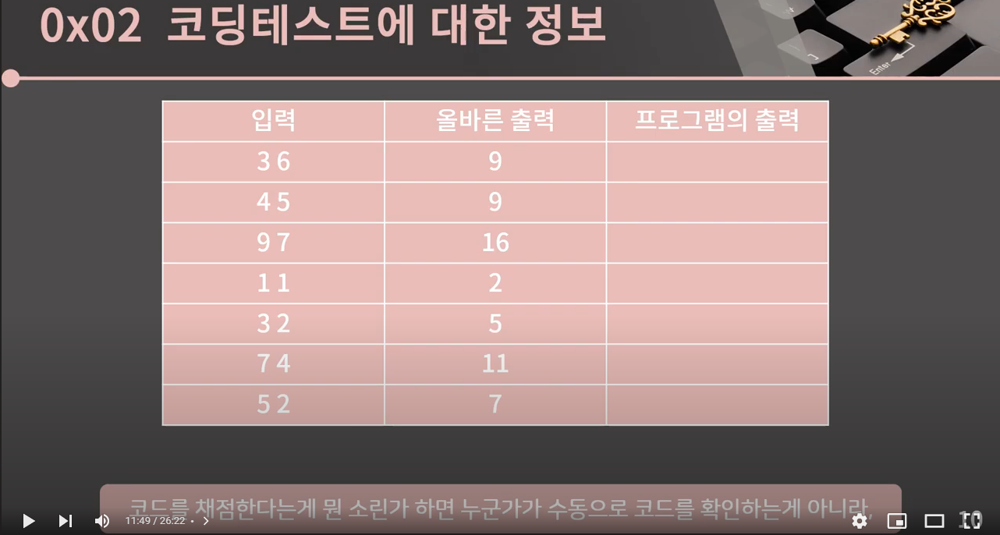

# 유튜브 비디오 하단 바를 제거해주는 Chrome Extension app
## problem
[이미지 출처](https://www.youtube.com/watch?v=jZwf4OPlhtk&list=PLtqbFd2VIQv4O6D6l9HcD732hdrnYb6CY&index=14)

유튜브에서 강좌를 듣던 중 영상을 정지할 때마다 하단 바가 거슬려 집중이 깨지는 문제가 있음

## demo

## 로컬 설치 방법
1. 레포지토리를 클론한다.
2. [chrome://extensions/](chrome://extensions/) 를 방문한다.
3. **Load unpacked** 를 클릭하고 해당 폴더를 업로드한다.
